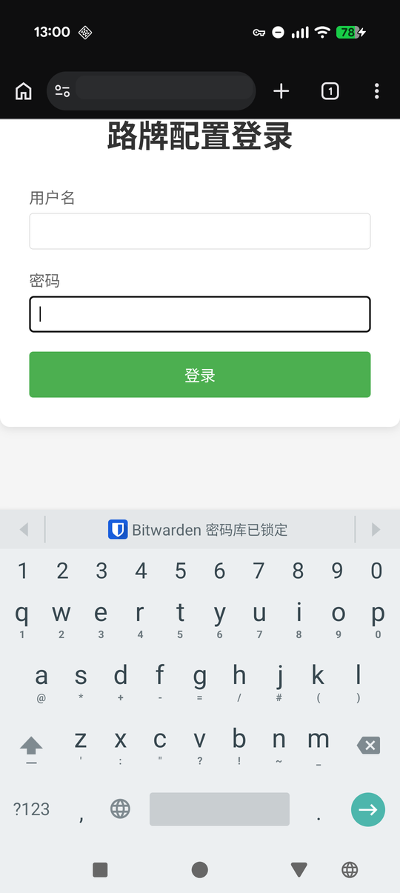
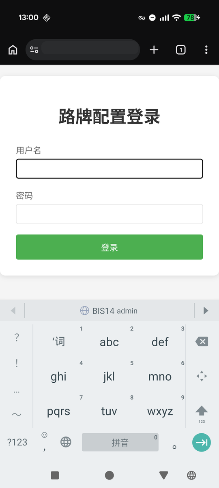
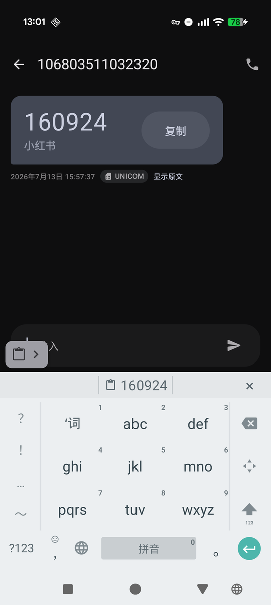
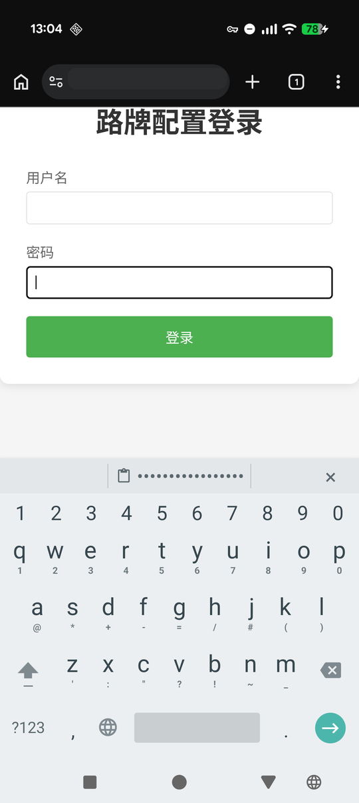
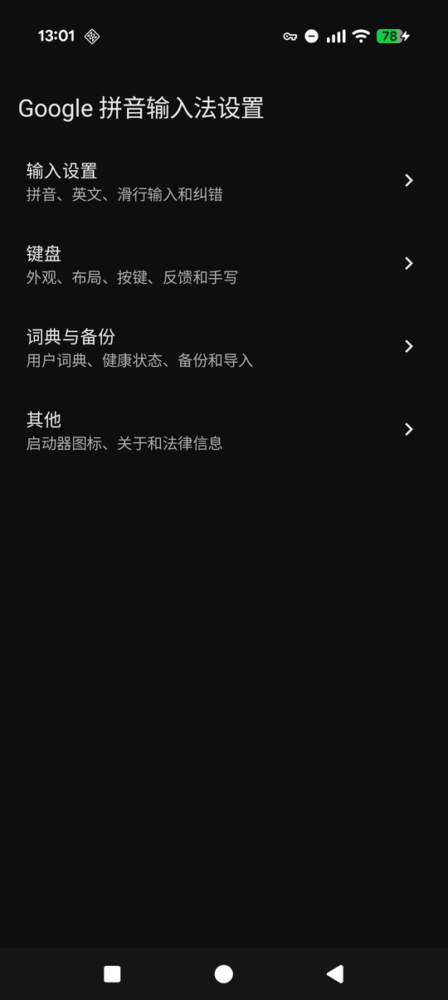
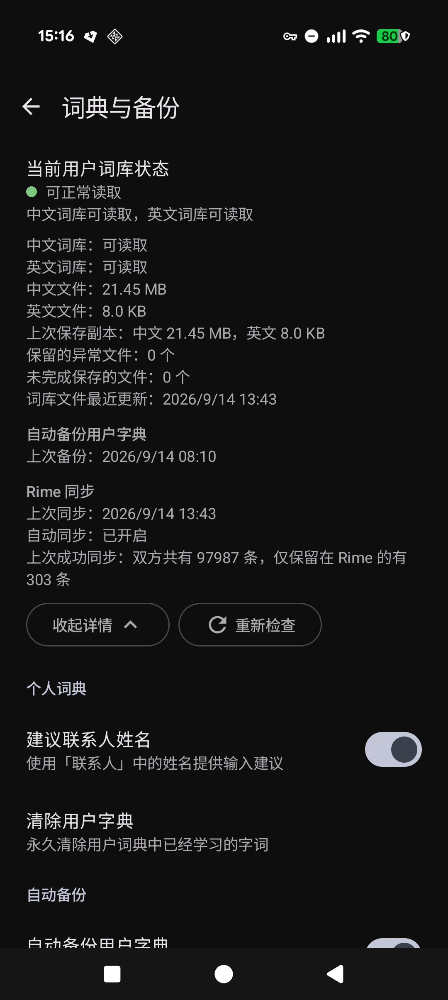

# Google 拼音输入法 创造性 AI 版

**Comeback Google Pinyin Input**

这是基于 Google 拼音输入法 4.5.2 的非商业兼容维护项目。项目尽量保持原生输入、候选、学习、词典、手写、主题、分页和触摸体验，同时修复旧应用在现代 Android 上的兼容问题，并以可复现、可审计的方式构建。

> Google 拼音输入法、原始程序、资源、词库、名称和相关商标的权利归 Google LLC、Google Inc. 或其各自权利人所有。本项目不隶属于 Google，也未获得 Google 官方背书。

## 下载

正式 APK 请从 [GitHub Releases](https://github.com/huaxianyan/ComebackGooglePinyinInput/releases) 下载。

```text
Application ID: com.google.android.inputmethod.pinyin.compat
Architecture:   arm64-v8a
target SDK:     36
```

兼容版使用独立包名和项目签名，可以与 Google 官方原版同时安装，但不能覆盖由 Google 官方证书签名的应用。升级本项目版本时，请始终使用 Releases 中采用同一正式证书签名的 APK。

## 相比原版的主要更新

### 现代 Android 兼容

- 完成 target SDK 29–36 的逐版本适配与验收，支持 Android 16 的 covering-IME、系统导航区域和 edge-to-edge 行为。
- 修复 Android 16 手写首笔崩溃，保留原有离屏画布、压感宽度、路径平滑和原生识别流程。
- 修复候选、标点、符号和表情滚动/翻页后的误触问题。
- Android 16 高刷新率屏幕上的候选面板展开/收起动画会在运动期间动态请求高刷，结束后立即释放，避免键盘空闲时持续锁定高刷新率。
- 补齐现代 Android 所需的组件导出、PendingIntent 和动态 Receiver 安全要求。

### 统一 Header、简繁切换、剪贴板与 Autofill

- 中文拼音 QWERTY、中文拼音 9 键和中文笔画支持原生「简/繁」快速切换，实际输入、候选和设置状态会同步更新，也可在「键盘 → 按键」中关闭该入口。Access Points 展开或空间不足时按钮自动隐藏，不覆盖语言、语音或收起键。
- 所有相关键盘使用统一原生 Header，密码、PIN、数字、电话和日期时间键盘的必需输入键始终保留在 Body。
- Clipboard 快捷粘贴继续使用真实原生 Candidate，来源标记敏感或密码目标中的内容会脱敏显示，点击仍提交完整原文。
- Android 11+ 支持标准 Inline Autofill Suggestions，直接托管 Framework/Provider 提供的远端 Surface，不读取凭据正文，也不自行提交 Autofill payload。
- 原生 Candidate、Clipboard 和 Inline Autofill 由统一 Header Platform 集中仲裁，并复用原生主题、分隔线、上一项/下一项控制和无障碍边界。

### 设置与首次引导

- Android 15/API 35 及以上使用源码构建的官方 Compose Material 3 设置界面，Android 14 及以下继续使用原版 Preference 设置。
- 现代设置保留原 Preference key、类型、默认值、依赖和业务回调，并支持动态配色、RTL、大字体、横屏、分屏和 TalkBack 语义。
- 「关于」页面提供当前项目的 [GitHub 仓库](https://github.com/huaxianyan/ComebackGooglePinyinInput) 入口。
- 首次引导整理为同页完成「启用输入法」和「选择输入法」，避免旧权限页、失效统计和重复引导状态。

### 用户词典与隐私

- 加固用户词典滚动备份和故障恢复，覆盖 `_bak`、中断 `_tmp`、不可读主文件隔离及并发保存保护。
- 支持通过 Storage Access Framework 选择本地、SD 卡或云端文档目录，进行自动备份、立即备份、版本轮换和原生合并导入。
- 词典状态区以颜色和文字共同显示词库可读取性，并显示自动备份与 Rime 同步的上次成功时间。
- 移除失效的 Google 账户词典同步、Firebase、反馈上传、统计和在线词典更新入口。
- 输入法不申请 Google 账户，不读取 Autofill 凭据正文，不把敏感剪贴板明文写入候选显示、无障碍文本、日志或持久化。

### Rime 用户词典同步

- 在「词典与备份」中授权一个同步目录后，可以在 Google 拼音与 Rime 各设备的用户词典之间同步词条的新增、删除和重新添加。
- 手动「立即同步」与自动同步共用同一套执行、恢复和安全校验逻辑，正常路径点击一次即可完成，只有首次接受处理规则或涉及删除时才需要确认。
- 自动同步默认关闭，开启后按所选间隔在后台运行，默认 24 小时，可选 6 小时、12 小时、24 小时、2 天、3 天和 7 天。
- 同步只处理多字词条的存在与删除，不换算历史词频，也不改写 Rime 的词频记录。
- 暂时无法由 Google 拼音直接接收的词条保留在 Rime，不阻塞其他词条，不修改原编码，也不转写英文用户词典。
- 更换同步目录时延续原有设备身份、盐、基线和保留标记，迁移完整合法的原有数据不需要删除任何设备文件夹。

### 复古 9 键

- 英文 9 键键盘新增可选的「复古 9 键」多击输入，默认关闭。打开后在同一数字键上连续点击，按点击次数从该键分组里选字母，超过字母数后循环回第一个字母。
- 多击是英文 9 键上的一个选项，不新增键盘布局，键盘选择页仍然只有「英文 26 键」和「英文 9 键」两个英文条目。
- 开关关闭时，`handle`、联想、自动纠错和标点候选全部交回原版 `English9KeyIme`，原版行为不变。
- 英文输入法本身不写入用户词典，多击不会污染英文词库。

完整版本变化见 [CHANGELOG.md](CHANGELOG.md)。设计、研究和验收记录见 [docs/](docs/)。

## 效果预览

### Inline Autofill

<table>
  <tr>
    <td width="50%" align="center">
      <br>
      登录字段中直接显示由 Android Framework 和 Autofill Provider 提供的建议
    </td>
    <td width="50%" align="center">
      <br>
      使用原生上一项、下一项控制切换多个建议，并保持 Provider 原始顺序
    </td>
  </tr>
</table>

### Clipboard 与敏感内容

<table>
  <tr>
    <td width="50%" align="center">
      <br>
      验证码复制后通过真实原生 Candidate 快速粘贴
    </td>
    <td width="50%" align="center">
      <br>
      密码目标中的敏感剪贴板只脱敏显示，点击仍提交完整原文
    </td>
  </tr>
</table>

### Material 3 设置与词典备份

<table>
  <tr>
    <td width="50%" align="center">
      <br>
      Android 15 及以上使用官方 Compose Material 3 设置界面
    </td>
    <td width="50%" align="center">
      <br>
      集中查看词典健康状态和 Rime 同步情况，并配置自动备份、版本保留和导入位置
    </td>
  </tr>
</table>

> 为公开展示保护站点信息，Chrome 截图中的地址栏文字已遮挡，其余号码、验证码和功能内容保持原样。

## 兼容性说明

- APK 只包含 `arm64-v8a` 原生库。Manifest 的 `minSdkVersion` 为 17，但 ARM64 Android 应用实际从 API 21 才存在。
- API 35+ 设置使用 Compose Material 3，API 17–34 保持旧设置路径，启动时不解析 Compose/AndroidX 设置类。
- Rime 同步设置位于 Android 15/API 35 及以上的现代设置界面。自动同步依赖系统 JobScheduler，从 Android 5.0/API 21 起可用，执行时机由系统后台调度安排。
- 复古 9 键设置位于英文输入分类，旧设置页与现代设置页都可以配置，开关变化立即生效。
- Inline Autofill 需要 Android 11/API 30 及以上，并取决于当前 App、Android Autofill Framework 和用户选择的 Autofill Provider。
- TalkBack touch exploration 下的 Inline Suggestions 尚未声明支持，系统会采用自身回退路径。
- Android 17/API 37、Predictive Back 和最终 16 KiB native page-size 运行时验收属于独立后续工作。

## 用户词典备份与恢复

在「设置 → 词典与备份」中选择一个 SAF 目录后，自动备份、立即备份和手动导入共用该目录。备份继续使用 Google 拼音原生用户词典导出/导入语义，项目不会创建不兼容的新词典格式，也不会自动扫描公共存储中的旧文件。

恢复时重新授权原备份目录，从内置列表选择备份并确认导入即可。云端同步、离线和保留能力由所选 DocumentsProvider 管理。

详细设计见 [用户词典自动备份设计](docs/dictionary-auto-backup-design.md)。

## Rime 用户词典同步

Rime 同步让 Google 拼音的用户词典与 Rime 生成的 `pinyin_simp.userdb.txt` 快照双向互通，适合手机与电脑共用一份词库。

1. 在 Rime 一端确认已经生成用户词典快照，并让快照与其他设备位于同一个同步目录中。
2. 打开「设置 → 词典与备份 → Rime 同步」，选择同步目录，填写本设备名称和 Rime 用户词典文件名。
3. 点击「立即同步」完成第一次同步。首次会出现一次处理规则说明，确认后按同一规则处理后续条目。
4. 需要自动同步时打开「自动同步」开关并选择间隔。开启说明会指出同步包含删除行为。

同步只处理多字词条的存在与删除，不换算历史词频。逐条查看仅保留在 Rime 的条目不是完成同步的前置步骤。目录授权、文件到达时机和离线能力由所选 DocumentsProvider 与外部同步软件负责，应用只处理执行时目录中已有的快照。

Rime 同步位于 Android 15 及以上的现代设置界面。详细设计见 [Rime 自动同步设计](docs/rime-auto-sync-design.md)。

## 复古 9 键

复古 9 键把英文 9 键键盘切回功能机时代的多次点击输入方式，适合习惯在数字键上敲字母的场景。开关默认关闭，只影响英文 9 键键盘。

1. 打开「设置 → 输入设置 → 英文」，找到「复古 9 键」。
2. 打开开关，切换到英文 9 键键盘，在同一数字键上连续点击即可循环选择字母。
3. 需要调整等待时间时，在开关下方修改「多击间隔」，默认为 600 ms。
4. 关闭开关即回到原版英文 9 键，联想、自动纠错和标点候选一并恢复。

打开复古 9 键后该键盘不再联想和纠错，词库本身不受影响。简体中文输入、中文九宫格、全键盘、手写和密码键盘都不受该开关影响。详细设计见 [英文 9 键多击设计](docs/english-t9-multitap-design.md)。

## 开发与审计

项目不是重写输入法，而是从固定原始 APK 可复现地应用资源和 Smali 补丁：

```text
original/        已校验的 Google 拼音 4.5.2 arm64-v8a 原始 APK
patches/         Java 源码、生成 Smali 和兼容资源
modern-settings/ API 35+ Compose Material 3 设置运行时
scripts/         补丁、构建和静态验证脚本
docs/            设计、研究、验收和兼容边界
```

- [原始 APK 来源与完整性](docs/original-apk-provenance.md)
- [本地构建、GitHub Actions 与发布流程](docs/build-and-release.md)
- [中文文案与排版规范](docs/chinese-copywriting-style.md)
- [Header Platform 架构](docs/header-platform-design.md)
- [Header Platform 运行时验收](docs/header-platform-runtime-acceptance.md)
- [现代设置运行时设计](docs/modern-settings-runtime-design.md)
- [Android target SDK 现代化计划](docs/target-sdk-modernization-plan.md)

## 许可证与权利范围

项目维护者拥有或有权许可、且在 [`NOTICE`](NOTICE) 中明确列出的原创代码、脚本和文档，自许可证声明公开之日起采用 [Mozilla Public License 2.0](LICENSE)：允许个人或组织免费或收费地使用、修改和商业分发，但须遵守 MPL-2.0 的源码提供及声明保留要求。

根目录许可证**不适用于整个仓库的所有内容**。Google 拼音输入法原 APK、Google 原始或派生代码、Smali、资源、词库、模型、图片、名称和商标，以及 AndroidX、Compose、Gradle 等第三方内容均不在本项目的 MPL-2.0 授权范围内，继续受各自权利和许可约束。权属混合或来源存在争议的文件也未被纳入。

- [MPL-2.0 完整文本](LICENSE)
- [精确适用范围、生效边界与排除项](NOTICE)
- [原始 APK 来源与权利边界](docs/original-apk-provenance.md)

本项目不隶属于 Google，也未获得 Google 官方背书。项目本身不收费、不接入广告，也不以 Google 品牌或原始程序牟利，但这不限制第三方在严格遵守适用许可证及第三方权利的前提下商业使用明确列出的 MPL Covered Software。如相关权利人认为仓库内容需要调整，可通过 GitHub Issues 联系项目维护者。
