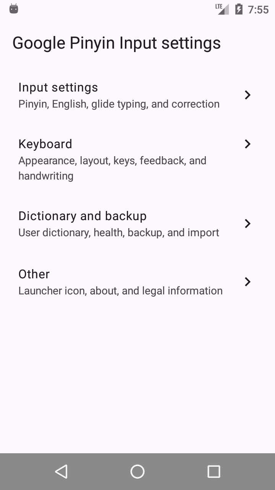
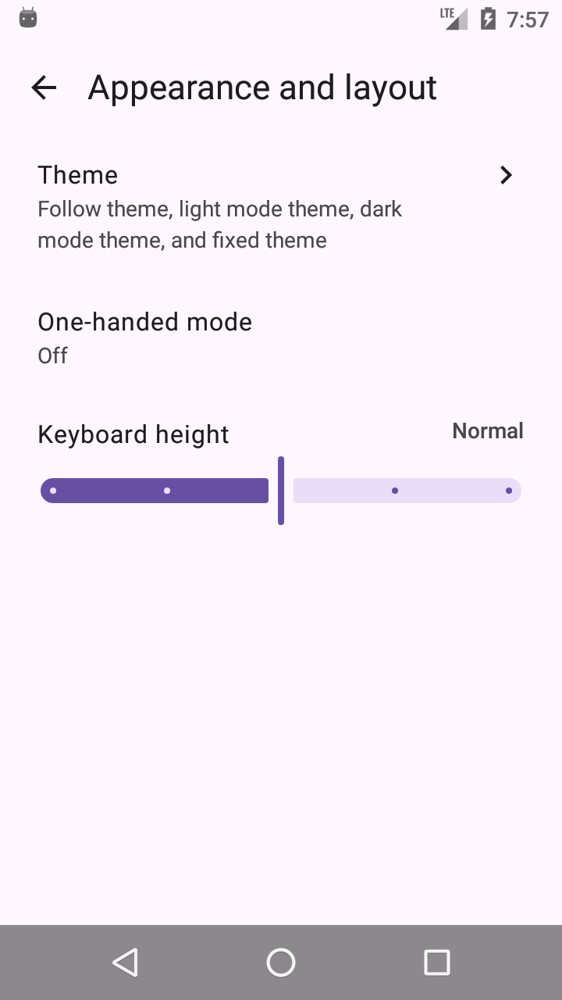
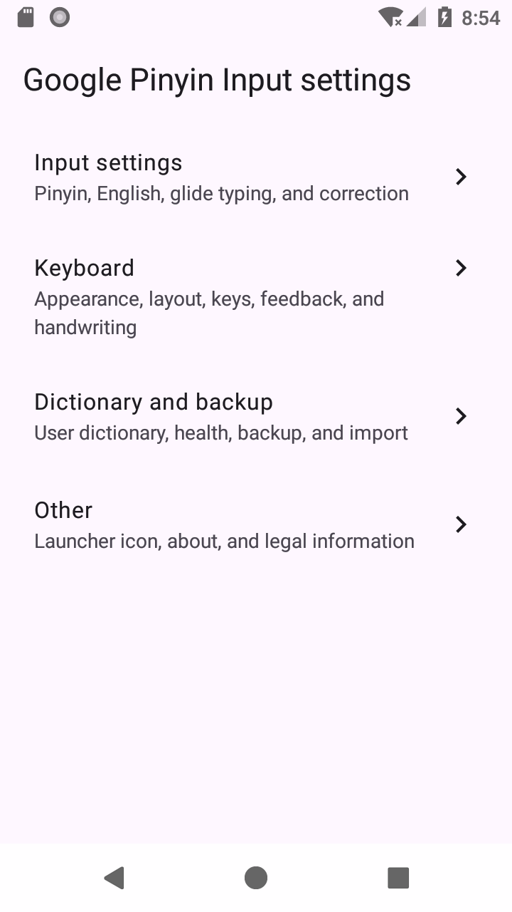
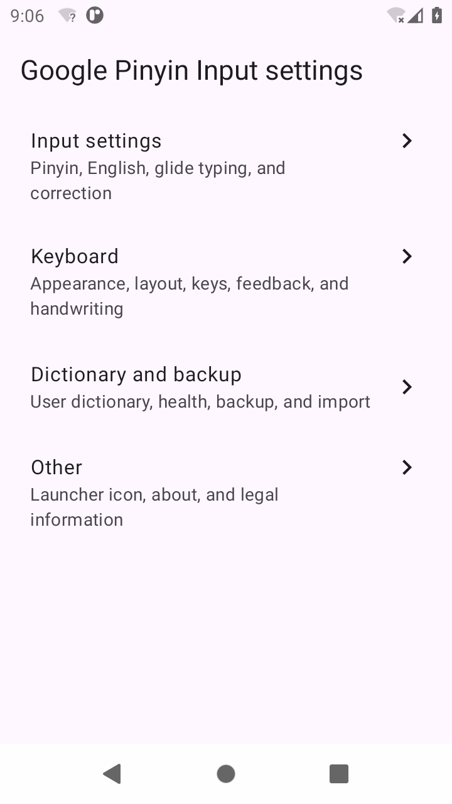
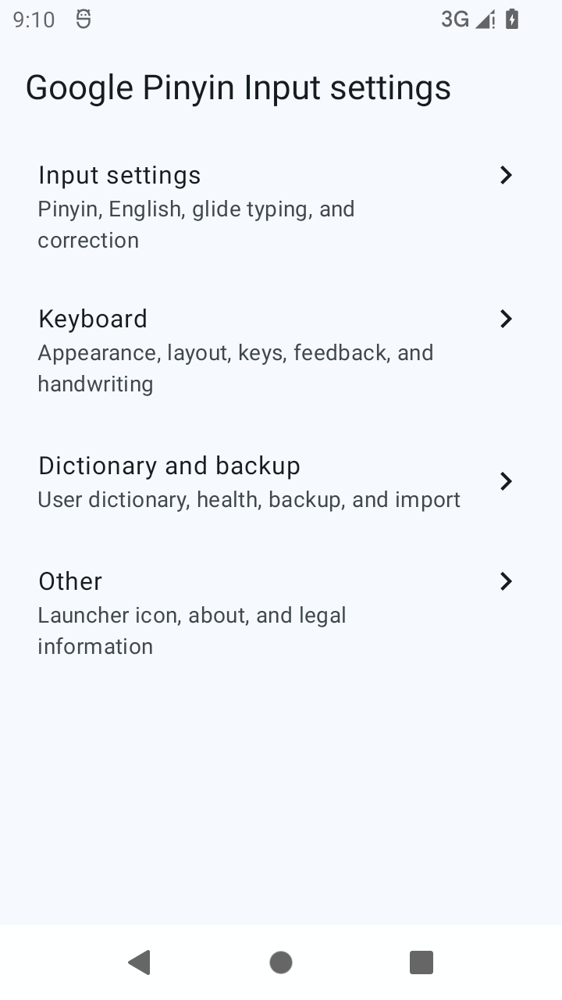
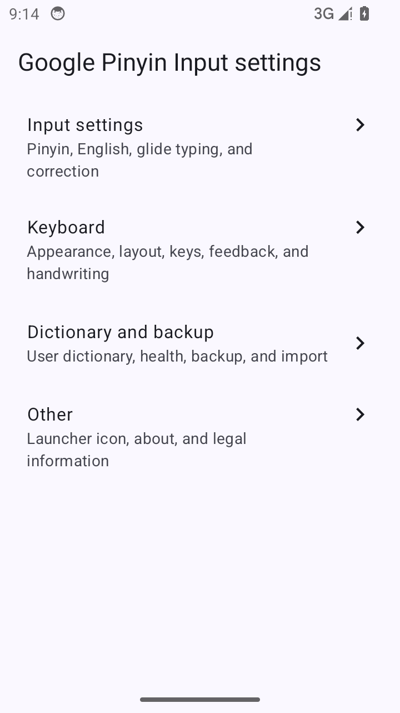

# 提升最低版本、弃用旧设置页与新主题选择页：先期调研

本文只做调研与前置工作拆解，不含实施。所有现状判断都标了证据来源，实测与推断分开写。

## 一、目标

三项改动，用户已明确：

1. **`minSdkVersion` 提到 23**（技术下限，实测见第三节）。
2. **弃用旧设置页**：用户在任何 Android 版本上、任何入口进去，**只会有新设置页**。
3. 旧设置页的**代码与资源不删除**，只是不再使用。

范围已确认包含：

- **首次引导一并 Compose 化**（当前是旧 Activity 重绘成 MD3 风格）。
- **自定义主题一并 Compose 化**（不拆阶段，实测已证明可行，见 5.2）。
- 主题选择页参考 Gboard 的形态。

### 1.1 「弃用」的具体含义

「让旧设置页不可达」有两种做法：

| 做法 | 说明 |
| --- | --- |
| 摘掉入口 | 从 `AndroidManifest.xml` 删掉旧活动的声明，系统无法启动它 |
| 保留入口但不路由 | 声明留着，点进去立刻跳转新页 |

用户要求「全程只有新页」，两种都能达到。**采用做法一（摘掉入口）**，更彻底，
旧页不再有任何可达路径。

**唯一例外**：IME 的 `settingsActivity` 声明必须仍指向一个可用活动，
否则系统设置里的齿轮会失效。处理方式是**删掉旧活动的对外声明，
把 `settingsActivity` 改指新活动**（详见 4.3 第 10 条）。

## 二、现状核实

### 2.1 版本与分流

| 项 | 值 | 来源 |
| --- | --- | --- |
| `minSdkVersion` | 17 | `scripts/apply_patches.py` 的 apktool.yml `sdkInfo` |
| `targetSdkVersion` | 36 | 同上，与 `version.properties` 一致 |
| Compose 库 minSdk | 23 | `scripts/prepare_compose_host_manifest.py` 注释 |

分流门禁**已启用**（`docs/modern-settings-preference-inventory.md` 的「Formal routing gate」）：

```text
API 17-34   旧 Preference 实现
API 35+     ModernSettingsActivity（按类名字符串路由）
```

分流**不是一处开关，而是两扇独立的门**。2026-10-02 在 API 23 模拟器上实跑确认，
改 minSdk 时必须同时处理这两处：

| # | 门 | 位置 | 表现 |
| --- | --- | --- | --- |
| 1 | smali 里的 `SDK_INT` 阈值 | `scripts/apply_patches.py:654`（`const/16 v1, 0x23`） | 35 以下不走 `setClassName` 重定向 |
| 2 | 清单里的组件启用开关 | `bool/modern_settings_runtime_enabled`，由 `scripts/prepare_compose_host_manifest.py:171` / `:187` / `:192` 生成 | 基础 `false`、仅 `values-v35` 为 `true`；35 以下组件被注册为**禁用** |

第 2 扇门最容易漏：只把 smali 的 `0x23` 改成 `0x17`，在 API 23 上仍会得到
`Error type 3: Activity class does not exist`（实测必须 `pm enable` 才起得来）。
实测记录见 10.5。

Compose host 的 `AndroidManifest.xml` 里 `minSdkVersion` 与 `targetSdkVersion` 都被**移除**
（AGP 9 要求写在 Gradle DSL），只留 `overrideLibrary` 例外清单，
用来放行 Compose 库的 minSdk 23 高于应用 minSdk 17 这件事。

### 2.2 现代设置页的规模与覆盖

`modern-settings/compose-runtime/.../compose/` 下 **31 个 Kotlin 文件**，已确认的信息架构：

```text
首页
├─ 输入（通用 / 中文 / 英文，模糊拼音在中文下）
├─ 键盘（外观与布局 / 按键与切换 / 按键反馈 / 手写）
├─ 词典与备份
└─ 其他
```

### 2.3 仍依赖旧实现的入口

这些是「弃用旧设置页」真正要处理的清单，逐条来自偏好清单与导航文件：

| 入口 | 现状 | 来源 |
| --- | --- | --- |
| 主题选择 | 复用未导出的同包 `ThemeSelectorActivity`，三个槽共用 | `LegacySettingsNavigation.kt:12` |
| 词典破坏性操作 | 联系人建议、清空词典仍在旧 fragment | 偏好清单「Specialized pages」 |
| 快捷方式词典编辑器 | 走系统 `android.settings.USER_DICTIONARY_SETTINGS` | 同上 |
| 许可证页 | 旧 `UnquantumLicenseMenuActivity` | `LegacySettingsNavigation.kt:28` |
| 首次引导 | 旧 `PinyinFirstRunActivity`，但已重绘为 MD3 风格 | 原版 manifest + `apply_patches.py` |
| TV 设置 | 旧 `TVSettingsActivity` | 原版 manifest |

### 2.4 主题选择页现状（用户点名的部分）

来自 `docs/gboard-system-auto-theme-research.md` 的「原版主题选择器与自定义主题生命周期」：

- 浅色、深色、固定三个槽**复用同一个未导出的 `ThemeSelectorActivity`**。
- 进入前临时物化目标槽，返回时提交该槽，所以选一个槽不会覆盖另外两个。
- **不复制**主题列表、图片裁剪、编辑器或预览逻辑。
- 内置主题 **17 套**（`builtin_theme_package_name_to_theme_name_map` 共 34 条，两两一对）。
- 自定义主题被编辑或删除时，用原版编辑器已解析出的替代/回退主题对更新所有引用旧文件的槽位。

## 三、关键决策点：minSdk 定在哪一档

用户已明确否决 35，要求提到「新设置页最低可应用的版本」。那就先把这个版本查清楚。

### 3.1 下限由依赖库决定，实测为 API 23

解出各依赖 AAR 的 `AndroidManifest.xml`，逐个看真实声明：

| 依赖 | 声明的 minSdk |
| --- | --- |
| `androidx.compose.ui:ui` | **23** |
| `androidx.compose.runtime:runtime` | **23** |
| `androidx.compose.foundation:foundation` | **23** |
| `androidx.activity:activity-compose:1.13.0` | **23** |
| `androidx.compose.material3:material3` | 21 |

**结论：新设置页的真实下限是 API 23（Android 6.0）。**

Compose 代码本身没有更高的硬需求。全部版本门控只有三处，且都做了降级：

- `ModernSettingsActivity.kt:744-745`：`SDK_INT >= 31` 才用动态配色，否则回落到静态配色方案。
- `SettingsCapabilities.kt:44`：动态配色开关在 31 以下不显示。
- `SettingsCapabilities.kt:43`：表情切换键要求 19 以上。

`enableEdgeToEdge()` 与 `registerForActivityResult()` 都来自 AndroidX，
版本差异由库自己兜住，不需要应用侧判断。

### 3.2 提到 23 的附带收益

`scripts/prepare_compose_host_manifest.py` 里那份长长的 `OVERRIDE_LIBRARIES`
（`androidx.activity`、`androidx.activity.compose`、`androidx.compose.*` 等十余项），
存在的**唯一理由**就是让应用 minSdk 17 与库的 23 共存。
minSdk 提到 23 后，这份例外清单可以整个删掉，少一处脆弱的手工维护点。

### 3.3 但 23 是「能编译」，不是「已验证」

必须说清楚：**Compose 设置页从未在 35 以下运行过**。
现在「API 35+ 才路由」的阈值，反映的是验证范围，不是技术下限。

所以 23 是**技术下限**，不是**已验证下限**。中间这一段（23–34）需要补验证，
验证量随下限降低而增大：

| 候选 | 新增验证面 | 说明 |
| --- | --- | --- |
| **23** | 最大（12 个版本区间） | 技术下限，覆盖 Android 6.0+ |
| 26 | 中等 | 覆盖 Android 8.0+ |
| 31 | 较小 | 全区间都有动态配色，但仍是首次在 35 以下跑 Compose |
| 35 | 零 | 用户已否决 |

**建议 23**：既然要降到技术下限，就一次降到位，避免以后再降一次、
把验证面重做一遍。代价是验证工作量大，且**必须有 23–34 的真机或模拟器**。

### 3.4 无设备条件下的验证策略（已确认）

用户已确认找不到 23–34 的设备，接受以**门禁、模拟器、用户反馈**三者结合替代真机验收。

这意味着验收强度必须如实标注，不能写成「真机验收通过」。可行的组合：

| 手段 | 能覆盖 | 不能覆盖 |
| --- | --- | --- |
| 静态门禁 | 旧路径不可达、资源与清单一致性、minSdk 与库下限匹配 | 任何运行时行为 |
| 模拟器（API 23–34） | Compose 运行时、MD3 组件、Insets、Back 导航、布局 | 真实 IME 窗口交互、厂商 ROM 差异 |
| 用户反馈 | 真机上的实际问题 | 不可控，只能事后修 |

**必须在文档与发布说明里写清楚**：23–34 区间是模拟器加静态门禁的结论，
不是真机验收。这一点不能含糊，否则后续出问题时无法判断当初验到了什么程度。

建议把「优先用模拟器跑通 23、26、29、31、34 五个代表版本」列为阶段 1 的具体动作，
而不是只笼统说「模拟器验证」。

### 3.5 首次实跑：API 23（Android 6.0）已通过

把「23 能不能跑」从推断变成实测：arm64 模拟器 + **正式版 APK**，
`logcat -b crash` 为空，首页 / 二级页 / 三级页 / 返回 / MD3 滑块全部正常。

**结论：Compose 设置页在 API 23 上能起来、能渲染、能导航，无崩溃。**
3.3 里「23 只是能编译、不是已验证」这条顾虑，对 API 23 已经不成立。

细节（模拟器选型、启动参数、两道闸、复现步骤）见第十节，不在此重复。
**五档已跑完**（23、26、30、31、34），27–29 因验证台限制无法实测，见 10.7。

## 四、先期工作清单

按依赖排序，`→` 表示前置。

### 阶段 0：决策（阻塞全部）

1. **定 minSdk 目标值**（见第三节）。
2. **定「弃用」的落地形式**：旧设置类是从 manifest 摘掉入口，还是保留入口但不路由？
3. **定首次引导是否一并 Compose 化**，还是继续用已重绘的旧 Activity。

### 阶段 1：验证面确认（定完 minSdk 立刻做）

> **本阶段已完成，结论见第十节。** arm64 模拟器可用且覆盖 23–36，
> Compose 设置页在 API 23 上实测通过。下面是原始条目，保留以备对照。

4. 确认目标区间有没有可用设备或模拟器。当前只有 Pixel 10 Pro / API 36。
   API 31–34 的 ARM64 模拟器或真机是**硬前置**，否则无法验收。
5. 在目标区间上跑一次 Compose 设置页，记录实际崩溃点。这是风险最高的一步。

### 阶段 2：补齐 Compose 侧缺口

6. **新主题选择页**（见第五节，独立专项）。**已收口（2026-10-06）**：
   清单、槽位解析、四槽当前指向、引擎渲染的键盘预览、四槽写入、自定义主题的编辑与删除、
   键盘快捷入口改指新页都已落地，并在 API 36 真机验收。
   仍是复用旧活动的部分：自定义主题的创建与编辑走 `ThemeBuilderActivity` / `ThemeEditorActivity`。
7. 词典破坏性操作入口的 Compose 化，或明确保留旧 fragment 并写清理由。**已做**：
   API 35+ 的联系人建议授权与清除用户词典已在当前页实现。
8. 许可证页的 Compose 化。**部分**：「关于」子页是 Compose，许可证本身仍是旧
   `UnquantumLicenseMenuActivity`。
9. 首次引导（若阶段 0 决定一并做）。**未做**：Compose 侧没有首次引导文件，
   现在仍是旧 Activity 用 `values-v35/first_run_md3.xml` 重绘。

### 阶段 3：弃用旧页的工程落地

10. **IME 的 `settingsActivity` 入口必须仍然可用**。系统的「输入法设置」齿轮走这个声明，
    现在指向旧 `SettingsActivity`：

    ```xml
    <!-- patches/res/xml/method.xml -->
    <input-method android:settingsActivity=
        "com.google.android.apps.inputmethod.pinyin.preference.SettingsActivity" />
    ```

    弃用旧页后，它要么保留为薄壳跳转，要么改指新活动。
    这一条**最容易漏**，漏了会导致系统设置里的入口点不进去。
    注意 `patches/res/xml/` 与 `patches/res/xml-v19/` 两份都要改，只改一份会漏掉一个版本区间。
11. 旧 Preference XML 与 smali 保留不动，但不再有可达路径。
12. 静态门禁确认旧路径不可达，并更新所有绑定 minSdk 17 与分流逻辑的断言。
    **注意分流有两道闸**（见 10.5）：除 smali 阈值外，
    还要改 `modern_settings_runtime_enabled` 这个 bool 资源，
    否则路由过去了但目标活动仍被禁用。

### 阶段 4：文档与门禁

13. 更新 `docs/modern-settings-runtime-design.md` 的迁移边界。
14. 更新 `docs/modern-settings-preference-inventory.md` 的「Formal routing gate」。
15. 更新 `AGENTS.md` 的项目基线条目（当前写的是 `minSdkVersion=17`）。
16. 新增门禁：确认旧路径不可达、确认新路径在目标区间可路由。

## 五、主题选择页专项

### 5.1 新页需要覆盖的能力

从现有实现反推，新页至少要覆盖：

1. **17 套内置主题的列表与预览**。
2. **三个槽的语义**：浅色、深色、固定，各自独立持久化。
3. **动态配色槽**（本版本新增，与上面三个并列）。
4. **与「跟随主题」的互斥置灰**（已有规则在 `ThemeSettingRules.canSelect()`，新页必须复用同一函数）。
5. **自定义主题**：图片选择、裁剪、生成主题包。
6. **主题编辑与删除**，以及删除时对所有引用槽位的回退更新。

### 5.2 自定义主题：实测结论比预想简单

原以为这是最大的未知，因为它可能涉及「从图片提取主色并生成主题包」的算法。
**实测推翻了这一假设：原版根本不从图片提取颜色。**

证据：

1. `Bitmap;->getPixel` 与 `Bitmap;->getPixels` 在整个 smali 里**只出现在 `ant.smali`**，
   而 `ant` 有 `BreakIterator`、`TextPaint`、`Canvas` 字段，是**文本排版**类，与主题无关；
2. `ThemeBuilderActivity`（1186 行，主题包构造者）**不直接调用任何 `Bitmap` 方法**，
   唯一的图片处理是 `a(Bitmap)Lcac;`，而它只是把图片写进
   `TransientFileCleaner` 的**临时缓存文件**并返回字节流；
3. `ThemePackageMetadata` 的字段只有：版本 `int`、一个 `String`、一个 `boolean`、
   `ThemeFlavor[]`、以及样式表文件名 `String[]`。**没有任何颜色字段**；
4. `assets/theme/` 下 75 个文件是 `style_sheet_<名字>.binarypb` 与
   `style_sheet_<名字>_border.binarypb` 成对出现，另有 `style_sheet_default.binarypb`
   及其屏幕宽度变体。

**结论：自定义主题 = 用户图片作背景 + 默认样式表，没有取色与量化算法。**

`StyleSheetConverter` 那条链（`bbm` 是组合器，`bbn` 用 `SparseArray` 做固定颜色映射）
是**给内置主题做颜色替换**用的，不是给自定义主题做图片分析用的。

### 5.3 因此 Compose 化的实际工作量

需要覆盖：

1. 17 套内置主题的列表与预览。
2. 四个槽的语义：浅色、深色、固定、动态配色。
3. 与「跟随主题」的互斥置灰（复用 `ThemeSettingRules.canSelect()`）。
4. 图片选择（SAF）、裁剪、写入主题包目录。
5. 主题编辑与删除，以及删除时对所有引用槽位的回退更新。

其中第 4 项**不需要复现任何颜色算法**，只是「选图、裁剪、按既有目录格式落盘」。
主题包格式已由本项目的 `ThemePackageMetadata` 解析代码掌握。

剩余风险集中在**裁剪交互**与**目录格式的逐字节对齐**，不再是算法不可知的问题。

### 5.4 Gboard 参考

仓库已有 `docs/gboard-system-auto-theme-research.md`，记录了 Gboard 的
「System Auto」表达方式、浅色与深色两套规格、以及自动模式与解析结果是两个层次。
新主题选择页可以参考它的信息组织，但**主题包格式与持久化契约仍以本项目既有实现为准**，
不要按 Gboard 的内部结构去改。

### 5.5 已落地的只读切片（2026-10-02）

按 5.2 的建议先做了只读部分：**主题清单与槽位解析**，不含预览、不含写入。
落点：

| 文件 | 内容 |
| --- | --- |
| `compose/ThemeCatalog.kt` | 纯逻辑：槽位表、主题项模型、清单装配与槽位解析规则 |
| `compose/ThemeCatalogScreen.kt` | 只读页：当前使用 + 内置主题 + 自定义主题三段 |
| `compose/LegacySettingsRepository.kt` | `readThemeCatalog()`，随 `SettingsSnapshot` 一起读出 |
| `scripts/verify_theme_slot_initialization.py` | 新增槽位键与 Compose 槽位表的**交叉核对** |

这一轮把此前只是「读代码推断」的契约变成了可断言的事实：

1. **内置主题 17 套，来源是数组 `entryvalues_builtin_additional_keyboard_theme`**，
   顺序即显示顺序。值形如 `assets:theme_package_metadata_color_black.binarypb`。
2. **显示名另有资源**：`builtin_theme_package_name_to_theme_name_map` 是
   34 项两两一对（值 → `kb_theme_*` 字符串），中文本地化已存在（`黑色主题`、`浅色主题` 等）。
   **这是名字的唯一来源**：`theme_package_metadata_*.binarypb` 实测只有
   field2（样式表文件名列表）与 field3（边框列表），**没有任何名字或颜色字段**，
   所以 `bbg.a(Context, metadata)` 对内置主题必然走空名字回退。
3. **写入契约**（`baq.a(Lamx)`）是两个键：`keyboard_theme` 与 `additional_keyboard_theme`。
   内置主题的 `keyboard_theme` **恒为 `material_dark_theme`**
   （`pref_entry_base_keyboard_theme` 就是它），实际生效的只有 `additional`。
4. **槽位键共四对**：`compat_theme_{light,dark,fixed,dynamic}_{keyboard,additional}`。
   `compat_theme_selection_slot` **只在「借道旧 Activity」时临时存在**，
   用于把选中结果写回正确的槽；Compose 侧直接读写就不需要它。
5. **动态槽不在可选中集合里**：桥接的 `isSelectableSlot` 只认 light/dark/fixed，
   动态槽只有开关没有选择器。它的值是 `files:dynamic_theme.zip`（生成包），
   清单里作为 `ThemeSource.Generated` 单独构造，**不会被 `user_theme_` 目录扫描捞到**。

**当时仍未做、也是唯一的真难点：键盘预览**。旧页用
`KeyboardPreviewRenderer$KeyboardPreviewRequestCanceler` +
`onKeyboardPreviewReady(String, Drawable)` 拿引擎渲染的预览图，
不是纯资源渲染；Compose 侧要么反射这条路，要么自绘。
写入路径与自定义主题（SAF 选图、裁剪、落盘）同样留到下一刀。

预览的三条路线对比见 `docs/compose-theme-preview-design.md`（2026-10-02）。
那一份把调用链逐行核实过了，结论是推荐反射引擎渲染，理由是前置条件已经满足：
两个必需的偏好键在 `preferences_pinyin_forced_values` 里都有强制值，
且渲染走独立 `InputBundleManager`，不依赖 IME 是否在前台。

**该方案已落地**（同日）：`ThemePreviewBridge.kt` + `ThemePreview.kt`，
清单页顶部固定预览、点行切换。新增门禁 `scripts/verify_theme_preview_bridge.py`
把「上游类改名」变成构建期失败。单元测试 83 通过 / 0 失败。**真机验证待做。**

### 5.6 写入与收口（2026-10-06）

上面留到「下一刀」的两项都做完了：引擎渲染预览已在 API 36 真机验收，
写入路径（四槽成对预览、浅色/深色/固定/动态槽、自定义主题的编辑与删除）也已落地。
清单页取代了「主题背景」页，磁贴改为模式单选，键盘快捷入口改指新路径。
细节与全部实测记录见 [主题预览设计](compose-theme-preview-design.md)。

唯一保留的降级项：弹层开着时切系统深浅色，预览不刷新（记录、不修）。

**仍未 Compose 化**：自定义主题的创建与编辑仍复用旧
`ThemeBuilderActivity` / `ThemeEditorActivity`，与第八节「一并 Compose 化，不拆阶段」
的决策不完全一致——现在是「入口 Compose 化、生命周期仍归旧活动」。

## 六、风险

| 风险 | 说明 |
| --- | --- |
| Compose 在 35 以下未验证 | **已下调**：API 23 实测通过（见第十节）。剩余风险是 26–34 的**覆盖面**，不是可行性 |
| 只改一处分流闸 | 分流有**两道**闸（见 2.1 与 10.5），只改 smali 阈值会得到「路由过去了、目标活动却被禁用」 |
| 自定义主题需要复现主题包格式 | 独立且不小的工程量，建议拆阶段 |
| 系统「输入法设置」入口失效 | 若漏改 IME 的 `settingsActivity` 声明，用户从系统设置进不去 |
| 门禁大面积失效 | 现有断言深度绑定 minSdk 17 与分流逻辑，需成批更新 |
| 放弃低版本用户 | 提到 35 等于放弃 Android 14 及以下，属于产品决策，需要用户明确确认 |

## 七、建议的推进顺序

1. **定 minSdk**。技术下限实测为 **23**，建议一次降到位，避免以后再降一次、
   把验证面重做一遍。
2. ~~**解决设备**~~。**已解决**：自建模拟器台，两条客户机路线互补（见第十节）。
3. ~~在目标区间上跑一次现有 Compose 设置页，记录真实崩溃点~~。**已完成五档**：
   23、26、30、31、34 全部通过、无崩溃。**27–29 是本机验证台的盲区**（10.7），
   文档与发布说明里必须写明这三档是推断而非实测。
4. 做阶段 2 的补齐，其中主题选择页按 5.2 的建议**先做只读部分**。
   **只读切片已完成**（见 5.5）：主题清单、槽位解析、四槽当前指向都能读出来并断言。
   剩下的是预览、写入与自定义主题。
5. 做阶段 3 的弃用落地，**重点盯 IME `settingsActivity` 入口**。
6. 顺手删掉 `OVERRIDE_LIBRARIES` 例外清单。
7. 最后统一更新门禁与文档。

## 八、已确认的决策

用户已拍板，不再待议：

| 决策 | 结论 |
| --- | --- |
| `minSdkVersion` | **23**（依赖实测下限） |
| 旧设置页 | **摘掉入口，彻底不可达**，代码与资源保留不删 |
| 覆盖范围 | 所有 Android 版本，任何入口进去只有新设置页 |
| 首次引导 | **一并 Compose 化** |
| 自定义主题 | **一并 Compose 化，不拆阶段**（实测无取色算法，见 5.2） |
| 23–34 验收 | 无设备，以**门禁 + 模拟器 + 用户反馈**替代，验收强度如实标注 |

## 九、下一步

### 9.1 已确认的两项实施前提

| 项 | 结论 |
| --- | --- |
| 模拟器 | 用户授权助手自行寻找合适的模拟器并做自动化测试，不需再确认 |
| 实施顺序 | **先做中间态，再逐步改动**，哪里有问题就修哪里 |

中间态的含义：先完成「minSdk 提到 23 + 摘掉旧入口 + 改指 `settingsActivity`」，
拿到一个可独立验收的版本，再依次补主题选择页与首次引导。

### 9.2 当前状态与进行中的位置

| 项 | 状态 |
| --- | --- |
| 2.1.4 重新发布 + 升级路径真机复测 | **已完成**，见 [2026-10-02 交接记录](handoff/2026-10-02.md) |
| 动态配色诊断版本 | **不再实施**（根因已定位并修复，见下方解除说明） |
| 本工程（新设置页） | **进行中** |

进行中的具体位置：**阶段 2 的主题选择页已收口（2026-10-06）**。清单、槽位解析、引擎渲染预览、
四槽写入、自定义主题的编辑与删除、键盘快捷入口改指新页都已落地，并在 API 36 真机验收
（见 [主题预览设计](compose-theme-preview-design.md)）。阶段 2 剩下第 9 条**首次引导
Compose 化**，以及第 6、8 条里仍是复用旧活动的那两处：自定义主题的创建与编辑走
`ThemeBuilderActivity` / `ThemeEditorActivity`，许可证页走 `UnquantumLicenseMenuActivity`。
TV 设置（`TVSettingsActivity`）也还没有归属。

**阶段 3 尚未开始**。当前实测值：`minSdkVersion` 仍是 17；两道闸仍是 35
（`apply_patches.py` 的 `const/16 v1, 0x23`，以及 `modern_settings_runtime_enabled` 的
基础 `false` / `values-v35` `true`）；IME 的 `settingsActivity` 仍指向旧 `SettingsActivity`
（`patches/res/xml/method.xml` 与 `patches/res/xml-v19/method.xml` 两份都没改）。
**含义**：这一刀做好的主题页目前在 API 34 及以下不可见，正是下放阶段要解决的问题。

顺序提醒：实际推进顺序与 9.1 相反。9.1 定的中间态（minSdk 提到 23 + 摘掉旧入口 +
改指 `settingsActivity`）本应在主题页与首次引导之前，实际是先做了主题页。
恢复推进时要么按 9.1 补中间态，要么明确调整顺序。

历史背景（已解除）：用户曾反馈 **2.1.4 的动态配色键盘在用户设备上不工作**，
且无法取得该设备，原计划先做一个带诊断日志与导出功能的 debug 版本，
设计见 [动态配色诊断日志设计](dynamic-color-diagnostics-design.md)。

**该阻塞已解除（2026-10-02）。** 动态配色失效的根因是槽位初始化的一次性标志，
与设备 ROM 无关，已在真机上修复并验证。诊断功能不再实施，本工程回到正常顺序。
见 [2026-10-02 交接记录](handoff/2026-10-02.md)。

## 十、验证面：模拟器实测（2026-10-02）

阶段 1 的硬前置是「23–34 有没有可用的验证载体」。本节把它实测清楚了。

### 10.1 结论：API 23 与 26 上跑通了

**Compose 设置页在 API 23（Android 6.0）上实测可正常运行**，用的是真实发布包，不是替身。



首页四个分区正常渲染，进入二级页、三级页、返回都正常，MD3 滑块（`Keyboard height`）也正常。



整个过程 `logcat -b crash` 为空，无崩溃。

**API 26（Android 8.0）同样通过**：`mResumedActivity` 指向新设置页，进程存活，
崩溃缓冲区为空，首页四个分区（输入 / 键盘 / 词典与备份 / 其他）全部正常渲染。



首轮在 API 26 上还看到过一条 **「System UI isn't responding」** 的 ANR 弹窗。
那是 **SystemUI 在 TCG 软件模拟下被饿死**，属验证台自身的性能问题，不是应用缺陷——
新设置页本身已经完整绘制在弹窗下面。给客户机加上
`settings put global hide_error_dialogs 1` 之后截图就干净了，
换成 10.4 的 x86_64 路线后这个问题彻底消失。

### 10.2 前提约束：应用只有 arm64

发布包 `lib/` 下只有 **arm64-v8a** 的 6 个 `.so`（`libpinyin_data_bundle`、`libhwrword`、
`libgnustl_shared` 等）。这一条同时约束了客户机架构和可用区间：

| 客户机 | 能跑真实应用吗 | 可用区间 | 说明 |
| --- | --- | --- | --- |
| x86_64 | 看转译层 | **API 30+** | `libndk_translation.so` 是 Android 11 才加的，30 以下没有 |
| arm64-v8a | 可以（原生） | **实测到 API 26** | 29 起确定起不来（见 10.3）；27、28 未测 |

转译层的有无可以直接读镜像的 `build.prop` 判断，不必启动：

```text
android-29/google_apis/x86_64          abilist=x86_64,x86                                  ← 无 arm64
android-29/google_apis_playstore/x86_64 abilist=x86_64,x86                                 ← 无 arm64
android-30/google_apis/x86_64          abilist=x86_64,x86,arm64-v8a,armeabi-v7a,armeabi    ← 有
```

`google_apis` 与 `google_apis_playstore` 两种 tag 都试过，29 都没有转译层。

两边合起来，**只有 API 27、28、29 落进了空档**：arm64 客户机起不来，x86_64 客户机又没有转译层。
这是验证台的能力边界，不是应用的问题。

`arm64-v8a` 镜像本身从 API 23 到 API 36 都有（`google_apis` 与 `default` 两种 tag）。
**但「镜像存在」不等于「能启动」**，见 10.3。

### 10.3 模拟器版本与 arm64 的 API 上限（实测）

**新版模拟器不支持 arm64。** 用 SDK 里的 37.2.12 启动 API 23 arm64 镜像，直接退出：

```text
FATAL | QEMU2 emulator does not support arm64 CPU architecture
```

改用 **34.2.16**（build id `12038310`）后可以正常启动。该版本需从归档地址单独下载并解压到独立目录，
**不要覆盖 SDK 里的 `emulator`**，否则会影响其他 AVD。

根因在 `main-emulator.cpp` 的 `kQemuArchs` 表：35.3（2024-08）起把它改成按宿主编译期宏
条件编译，`arm64` 一项只在 `__aarch64__` 宿主上存在。于是 x86_64 宿主上查表返回 `NULL`，
触发这条报错。**34.2.16 是最后一个还能在 x86_64 宿主上跑 arm64 客户机的版本。**

**但这还不够——arm64 镜像有 API 上限。** 同一台机器、同一份模拟器、同一套参数，
逐档实测的结果是：

| 镜像 | 结果 |
| --- | --- |
| `android-23` arm64 | **启动成功**，`uname -m=aarch64` |
| `android-26` arm64 | **启动成功**，`uname -m=aarch64` |
| `android-29` arm64 | `PANIC: Avd's CPU Architecture 'arm64' is not supported…` |
| `android-31` arm64 | 同上 |
| `android-34` arm64 | 同上 |

排除过程：

- 两档 AVD 的 `config.ini` **逐行 diff 只差 `image.sysdir.1` 与 `target`**，
  连 `hw.cpu.arch=arm64`、`abi.type=arm64-v8a` 都一致。
- 新建一个全新的 API 29 arm64 AVD，同样 PANIC —— 不是 AVD 被写坏。
- 换成 AOSP 的 `default` tag 镜像（`android-29;default;arm64-v8a`），同样 PANIC ——
  不是 `google_apis` tag 的问题。
- `source.properties` 的 `SystemImage.Abi` 都是 `arm64-v8a`；34.2.16 自带
  `qemu-system-aarch64.exe`；去掉 `-qemu -machine virt` 报错不变。

所以**不是配置问题，是这套模拟器对 API 28 以上的 arm64 镜像一律拒收**。
分界点为什么落在 27/28 之间，本次没有查到确证，不做推测。

**含义**：arm64 路线**实测只覆盖到 API 26**；27、28 未测，29 起确定不行。
29 及以上必须换载体，方案是 x86_64 镜像 + ARM 转译层，见 10.4。

必须的参数组合，缺一不可：

```text
emulator -avd <名称>
  -sysdir <SDK>/system-images/android-23/google_apis/arm64-v8a
  -gpu swiftshader_indirect    # 否则黑屏
  -accel off                   # x86 宿主机上模拟 arm64，无法硬件加速
  -memory 4096 -cores 4        # 核数给太多反而不稳
  -no-window -no-snapshot -no-boot-anim -no-audio
  -qemu -machine virt          # 否则报 "PCI bus not available for hda"
```

**代价**：纯软件模拟。冷启动到 `sys.boot_completed=1` 实测约 **10 分钟**，界面响应明显迟缓。
截图与日志采集可用，但逐项 UI 走查会很慢。

判断是否真的跑在 arm64 上，看这三个属性：

```text
ro.product.cpu.abilist      arm64-v8a
ro.dalvik.vm.native.bridge  0           # 0 表示没走转译，是原生 arm64
uname -m                    aarch64
```

### 10.4 API 28 以上走 x86_64 + 转译层（实测）

API 28 起 arm64 客户机起不来（10.3），只能换 x86_64。好在 API 30+ 的 x86_64 镜像
自带 ARM64 转译层，**真实发布包可以直接装上去跑**：

```text
ro.product.cpu.abilist         x86_64,arm64-v8a
ro.dalvik.vm.native.bridge     libndk_translation.so
ro.enable.native.bridge.exec   1
```

`emulator -accel-check` 显示 **WHPX 可用**，所以 x86_64 客户机是硬件加速的，
速度与 arm64 的 TCG 完全不在一个量级：

| 客户机 | 冷启动 | 一轮验证（装包 + 启活动 + 截图） |
| --- | --- | --- |
| arm64 / TCG | 2–10 分钟 | 分钟级，且 SystemUI 会被饿出 ANR |
| x86_64 / WHPX | **约 86 秒** | **约 1 分钟**，界面流畅无 ANR |

**结论：28 以上一律用 x86_64；arm64 只用于 23–26。** 两条路线互补，没有重叠。

实际跑通的三档（每档都留了截图，`logcat -b crash` 全为空）：

| 档位 | 客户机 | 结果 |
| --- | --- | --- |
| API 30（Android 11） | x86_64 + 转译 | 通过 |
| API 31（Android 12） | x86_64 + 转译 | 通过 |
| API 34（Android 14） | x86_64 + 转译 | 通过 |







**这里跑的是只带 arm64 原生库的正式包**：`libndk_translation.so` 确实把 arm64 的
`.so` 托起来了，`PinyinApp` 的 `<clinit>` 没有报 `UnsatisfiedLinkError`，
设置页正常起来。也就是说 x86_64 客户机在这里不是「近似环境」，而是真能跑正式包。

顺带记一个用不上的候选：`modern-settings/compose-integration-prototype` 是个 **application** 模块
（applicationId `com.google.android.inputmethod.pinyin.materialcomposeaudit`），依赖 `:compose-runtime`，
清单里声明的就是真实的 `ModernSettingsActivity`，并打包了四种 ABI，本来很适合做纯 Compose 载体。
**但它缺 legacy dex**，而 `LegacyRimeSyncRepository` 用 `Class.forName` 反射
`...rimesync.RimeSyncSettingsCompat`（无 try/catch），在载体里必然抛
`ClassNotFoundException`。既然真实包能跑，就不必再补桩类了。

### 10.5 分流其实有两道闸（本次新发现）

调研原先只记了 smali 里的阈值。实测发现**还有第二道，而且更硬**：

| 闸 | 位置 | 现值 | 作用 |
| --- | --- | --- | --- |
| 路由阈值 | `scripts/apply_patches.py` 的 `const/16 v1, 0x23` | 35 | `SettingsActivity` 是否跳转新页 |
| 组件启用 | `res/values/modern_settings_runtime.xml` 的 `modern_settings_runtime_enabled` | `false` | 活动本身是否可用 |

第二道由 `scripts/prepare_compose_host_manifest.py` 生成：基础 `values/` 写 `false`，
`values-v35/` 写 `true`。**API 34 及以下这个活动是被禁用的**，`am start` 直接报
`Activity class does not exist`。

`docs/modern-settings-runtime-design.md` 记了这件事，但**本文的阶段 3 原清单没写**，
现已补进第 12 条。只改 smali 阈值会得到「路由过去了、目标活动却不可用」。
中间态必须同时改这两处；`scripts/verify_modern_settings_runtime.py:1056-1063`
断言了 `false` / `true` 两个变体并存，也要一并改掉。

实测手法：`pm enable <组件>` 临时启用后即可启动，10.1 的截图就是这么拿到的。

### 10.6 复现方式

脚本留在 `work/emulator/`（未入库）：

- `emu-adb.sh`：adb 封装。沙箱会在命令之间回收 adb server，所以每次都要 `start-server`
  并重新注册客户机；还必须 `MSYS_NO_PATHCONV=1`，否则 `/sdcard/...` 会被 Git Bash
  改写成 Windows 路径。**反过来，`MSYS_NO_PATHCONV=1` 又让 `adb.exe` 收到 `/e/...`
  这种它认不出的路径**，凡跨这条边界的路径都要用 `cygpath -w` 转一次——
  漏了会表现为「装包失败、随后 `am start` 报 Activity 不存在」，极易误判成路由问题。
- `boot-api.sh <api> [port]`：建 AVD、压到 720x1280、用 34.2.16 启动 arm64 客户机，
  等 `sys.boot_completed=1`，然后**持有**客户机。
- `boot-x64.sh <api> [port]`：同上，但走 x86_64 + WHPX，约 86 秒起来。
- `check-api.sh <api> [port]`：装真实包 → `pm enable` 新设置活动 → `am start` →
  记录 `mResumedActivity` / 进程 / 崩溃缓冲区 → 截图。

两条验证台经验值得记：

1. **沙箱会回收长时间的前台命令，并把子进程一起带走。**
   所以「启动客户机」与「验证」必须分开：客户机由后台任务持有，验证用短命令打进去。
   曾把两者串进同一个脚本，脚本被回收时客户机跟着死，表现成「模拟器无故退出」。
2. **别用 `cmd | tail` 包住长命令**：输出全被 `tail` 缓冲，工具侧长时间看不到任何输出，
   更容易被当成卡死回收。让输出直接流进日志文件，再 `tail` 文件。

完整流程：

```text
1. 装镜像  sdkmanager --install "system-images;android-<api>;google_apis;{arm64-v8a|x86_64}"
2. 启动    RUN_CHECK=1 ./boot-api.sh <api>    # arm64，23–26
           RUN_CHECK=1 ./boot-x64.sh <api>    # x86_64，30+
3. 等就绪  tail -f api<api>-boot.log           # 出现 "holding" 即已就绪
4. 结果    api<api>-check.log 与 shots/api<api>-modern-settings.png
5. 关闭    ./emu-adb.sh emu kill
```

### 10.7 对阶段 1 的结论

| 原计划的硬前置 | 现状 |
| --- | --- |
| 23–34 有没有可用设备或模拟器 | **已解决**，两条客户机路线互补 |
| 在目标区间跑一次 Compose 设置页 | **五档完成**：23、26、30、31、34，全部通过且无崩溃 |

覆盖情况如实记录：

| 区间 | 载体 | 状态 |
| --- | --- | --- |
| 23–26 | arm64 / TCG | **已实测**（23、26） |
| 27–29 | 无 | **未实测**：arm64 客户机起不来（10.3），x86_64 客户机又没有转译层（10.2） |
| 30–34 | x86_64 / WHPX + 转译 | **已实测**（30、31、34） |

**27–29 这三档在本机验证台上无解**，属环境限制而非应用问题：
26 与 30 两侧的结论一致，Compose 库在这段区间也没有行为差异。
但「一致」是推断，**发布说明与文档里要写明这三档是推断、不是实测**。

**风险等级下调**：「Compose 在 35 以下会不会崩」不再是未知。
剩下的是 27–29 的覆盖缺口，以及真机与厂商 ROM 的差异。

**边界不变**：模拟器验的是 Compose 运行时与布局，验不了 IME 窗口交互与厂商 ROM 差异。
3.4 里写明的那条不因本次实测而改变。
